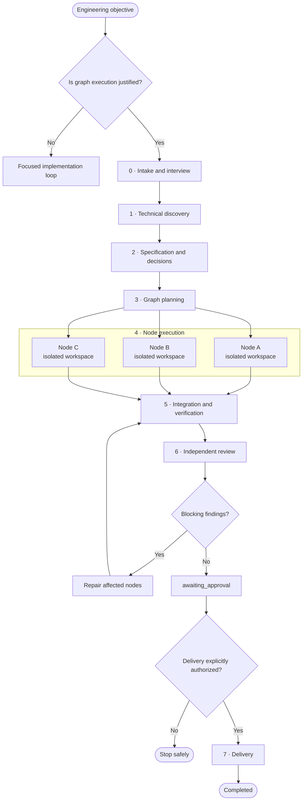

# Zen Workflow

Zen Workflow is a dependency-aware workflow for complex engineering work. It
keeps planning, implementation, integration, review, and approval evidence in
persisted artifacts while specialist agents work on bounded deliverables.

Use it when a change spans multiple components or independent workstreams and
safe parallel execution will materially help. For a small change with one
owner and one verification loop, use a focused implementation loop instead.

## Start

Invoke the skill with an engineering objective:

```text
Use $zen-workflow to execute this complex engineering objective as an isolated,
dependency-aware task graph.
```

The detailed operating contract is in [SKILL.md](SKILL.md).

## Workflow



Parallel nodes run only when their dependencies are satisfied, owned paths do
not overlap, and each writer has an isolated workspace. Integration waits for
validated handoffs from every dependency. Delivery is optional and requires
action-specific authorization.

## Phases and outputs

| Phase | Purpose | Primary persisted output |
|---|---|---|
| [0 · Intake](workflows/00-intake.md) | Define the outcome, scope, assumptions, and open questions | `.agent/intake.md`, `.agent/open-questions.md` |
| [1 · Discovery](workflows/01-discovery.md) | Map affected code, conventions, risks, and verification commands | `.agent/context.md`, `.agent/repository-map.json` |
| [2 · Specification](workflows/02-specification.md) | Accept behavior, constraints, decisions, and testable criteria | `.agent/spec.md`, `.agent/decisions.md` |
| [3 · Graph planning](workflows/03-graph-planning.md) | Define nodes, dependencies, ownership, and execution strategy | `.agent/graph.json`, `.agent/state.json`, `.agent/tasks/` |
| [4 · Node execution](workflows/04-node-execution.md) | Produce bounded changes and evidence in isolated workspaces | `.agent/handoffs/<node-id>.json` |
| [5 · Integration](workflows/05-integration.md) | Combine changes and run repository-level verification | `.agent/handoffs/integration.json`, `.agent/reports/verification.md` |
| [6 · Review](workflows/06-review.md) | Independently inspect the final diff and evidence | `.agent/reports/review.json`, `.agent/reports/final-summary.md` |
| [7 · Delivery](workflows/07-delivery.md) | Prepare or perform only the explicitly authorized action | Action-specific execution and rollback evidence |

## Core rules

- Conversation history is not workflow state; persisted artifacts are.
- A node starts only after its dependencies and handoffs validate.
- Concurrent writers use non-overlapping paths and isolated workspaces.
- Completion claims require inspected command and artifact evidence.
- New evidence reopens the earliest phase whose accepted output must change.
- Destructive, irreversible, production, security, merge, and deployment
  actions require explicit approval.

See [Workflow State](references/workflow-state.md),
[Parallel Execution](references/parallel-execution.md),
[Failure Handling](references/failure-handling.md), and
[Approval Boundaries](references/approval-boundaries.md) for the full rules.

## Repository map

```text
.
├── SKILL.md       # Entry point, lifecycle, gates, and operating rules
├── agents/        # Skill metadata
├── prompts/       # Specialist, integration, repair, and review roles
├── references/    # Shared state, safety, context, and failure rules
├── templates/     # Canonical workflow artifacts
└── workflows/     # Phase-by-phase execution instructions
```

The README is an overview. `SKILL.md`, the phase workflow files, references,
and templates remain the source of truth.
